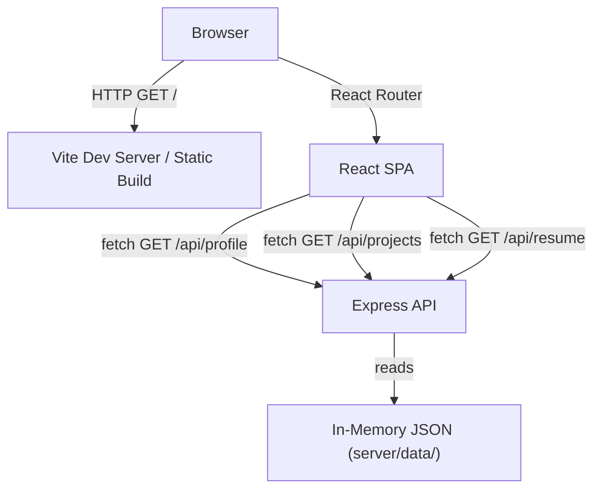

# Design Document

## Overview

This document describes the technical design for migrating Johnny Tran's static HTML/CSS portfolio into a modern full-stack application. The existing content (resume, games/projects) is preserved and enhanced with a React SPA frontend and a lightweight Node.js/Express backend serving static JSON data.

The result is a single-page application with client-side routing, Framer Motion page transitions, Tailwind CSS responsive layouts, and a dark mode toggle — all backed by an Express API that serves profile, projects, and resume data from in-memory JSON modules.

**Tech Stack:**
- Frontend: React (Vite), Tailwind CSS, Framer Motion, React Router v6
- Backend: Node.js, Express
- Data: Static in-memory JSON (no database)

---

## Architecture

The app follows a classic client/server split with the frontend and backend living in the same repository under `client/` and `server/` directories respectively.

```
portfolio/
├── client/          # React (Vite) SPA
│   └── src/
│       ├── pages/
│       ├── components/
│       ├── hooks/
│       ├── api/
│       └── assets/
└── server/          # Node.js/Express API
    ├── routes/
    ├── data/
    └── index.js
```



**Request flow:**
1. Browser loads the React SPA (served by Vite in dev, or a static host in prod).
2. React Router handles all `/` routes client-side — no server round-trip for navigation.
3. Pages that need data call the Express API at `/api/*`.
4. Express reads from in-memory JSON modules and responds with structured JSON.

**Dark mode** is managed entirely on the frontend via a React context + `localStorage` persistence. The `dark` class is toggled on the `<html>` element, which Tailwind's `darkMode: 'class'` strategy uses.

---

## Components and Interfaces

### Frontend Components

**`AnimatedPage`** — wraps every page component; applies Framer Motion fade + y-offset entry transition. Respects `prefers-reduced-motion`.

```jsx
// Props
{ children: ReactNode }
```

**`NavBar`** — persistent top nav rendered in the root layout. Contains logo/home link, route links, hamburger toggle (mobile), and dark mode toggle button.

**`ProjectCard`** — renders a single project entry.
```jsx
// Props
{ project: ProjectData, index: number }
// index drives the stagger delay
```

**`SkillTag`** — small pill badge for a skill string.
```jsx
{ skill: string }
```

**`LoadingSpinner`** — centered spinner shown while API data is in flight.

**`ErrorMessage`** — displays a user-readable error string when an API call fails.

**`DarkModeToggle`** — button that calls the `useDarkMode` hook to flip the theme.

### Frontend Pages

| Route | Component | Data Source |
|---|---|---|
| `/` | `HomePage` | ProfileData (via `GET /api/profile`) |
| `/about` | `AboutPage` | ProfileData (via `GET /api/profile`) |
| `/projects` | `ProjectsPage` | ProjectData[] (via `GET /api/projects`) |
| `/resume` | `ResumePage` | ResumeData (via `GET /api/resume`) |
| `*` | `NotFoundPage` | — |

### Frontend Hooks

**`useDarkMode()`** — reads/writes `localStorage` key `theme`, toggles `dark` class on `<html>`, returns `[isDark, toggle]`.

**`useFetch(url)`** — generic data-fetching hook returning `{ data, loading, error }`. Used by all pages.

### API Modules (`client/src/api/`)

```js
// profile.js
export const fetchProfile = () => fetch('/api/profile').then(r => r.json())

// projects.js
export const fetchProjects = () => fetch('/api/projects').then(r => r.json())

// resume.js
export const fetchResume = () => fetch('/api/resume').then(r => r.json())
```

### Backend Routes

| Method | Path | Handler | Response |
|---|---|---|---|
| GET | `/api/profile` | `routes/profile.js` | `ProfileData` (200) or error (500) |
| GET | `/api/projects` | `routes/projects.js` | `ProjectData[]` (200) or error (500) |
| GET | `/api/resume` | `routes/resume.js` | `ResumeData` (200) or error (500) |

---

## Data Models

### ProfileData

```json
{
  "name": "Johnny Tran",
  "tagline": "Aspiring Web & Games Developer",
  "bio": "Hello! I'm a passionate developer focused on creating beautiful and functional web experiences and also make videogames. I enjoy learning new technologies and building cool projects.",
  "skills": ["HTML", "CSS", "Java", "SQL", "JavaScript", "React"],
  "contact": {
    "email": "lancercrusher2@gmail.com",
    "github": "https://github.com/TfxNexus"
  }
}
```

### ProjectData

```json
{
  "id": "string",
  "title": "string",
  "description": "string",
  "category": "Games | Personal Projects | Interests",
  "techStack": ["string"],
  "repoUrl": "string | null",
  "liveUrl": "string | null",
  "imageUrl": "string | null"
}
```

The `category` field drives the visual grouping on the Projects page. The frontend groups `ProjectData[]` by `category` and renders each group under its own heading.

**Seed entries (from existing site):**

```json
[
  {
    "id": "osu",
    "title": "osu!",
    "description": "A popular rhythm game I enjoy playing.",
    "category": "Games",
    "techStack": [],
    "repoUrl": null,
    "liveUrl": "https://osu.ppy.sh",
    "imageUrl": "/assets/osu-logo.jpg"
  },
  {
    "id": "valorant",
    "title": "Valorant",
    "description": "A tactical first-person shooter game.",
    "category": "Games",
    "techStack": [],
    "repoUrl": null,
    "liveUrl": null,
    "imageUrl": null
  },
  {
    "id": "fortnite",
    "title": "Fortnite",
    "description": "Highly demanding mechanics game. Building and shooting battle royale styled.",
    "category": "Games",
    "techStack": [],
    "repoUrl": null,
    "liveUrl": null,
    "imageUrl": "/assets/fortnite-logo.jpg"
  }
]
```

### ResumeData

```json
{
  "experience": [
    {
      "title": "Backend Intern",
      "company": "Friend Group",
      "period": "March 2025 – Present",
      "description": "Worked on SQL for the backend using tables and views. Created a database and tried to connect to the frontend."
    }
  ],
  "education": [],
  "skills": ["HTML", "CSS", "Java", "SQL", "JavaScript", "React"]
}
```

### Dark Mode State (client-side only)

Stored in `localStorage` under the key `"theme"` with values `"dark"` or `"light"`. No server involvement.

---

## Correctness Properties

*A property is a characteristic or behavior that should hold true across all valid executions of a system — essentially, a formal statement about what the system should do. Properties serve as the bridge between human-readable specifications and machine-verifiable correctness guarantees.*

### Property 1: NavBar is present on every page

*For any* valid route (`/`, `/about`, `/projects`, `/resume`), rendering the full app at that route SHALL include the NavBar component in the output.

**Validates: Requirements 2.1**

---

### Property 2: NavBar active indicator matches current route

*For any* of the four primary routes, rendering the NavBar with that route active SHALL result in exactly one navigation link carrying the active visual indicator, and it SHALL be the link corresponding to the current route.

**Validates: Requirements 1.5**

---

### Property 3: Home Page renders all ProfileData fields

*For any* valid ProfileData object (with non-empty name, tagline, and bio), rendering the Home Page with that data SHALL display the name, tagline, and bio in the output.

**Validates: Requirements 3.1, 3.2**

---

### Property 4: About Page renders all ProfileData fields

*For any* valid ProfileData object, rendering the About Page with that data SHALL display the bio, all skills as individual tags, and both the email and GitHub contact links.

**Validates: Requirements 4.1, 4.2, 4.3**

---

### Property 5: Projects Page renders one card per project

*For any* non-empty array of ProjectData objects, rendering the Projects Page with that data SHALL produce exactly one project card per entry in the array.

**Validates: Requirements 5.3**

---

### Property 6: Project card displays all required fields

*For any* ProjectData object, rendering a ProjectCard SHALL display the project's title, description, and all tech stack tags in the output.

**Validates: Requirements 5.4**

---

### Property 7: Resume Page renders all ResumeData entries

*For any* valid ResumeData object, rendering the Resume Page with that data SHALL display all experience entries, all education entries, and all skills.

**Validates: Requirements 6.3**

---

### Property 8: No horizontal overflow at any standard viewport width

*For any* viewport width in the range [320px, 1920px], rendering any Page SHALL not produce a horizontal scrollbar (i.e., `scrollWidth <= clientWidth`).

**Validates: Requirements 10.4**

---

### Property 9: Reduced-motion disables AnimatedPage transitions

*For any* component wrapped in AnimatedPage, when the `prefers-reduced-motion: reduce` media query is active, the component SHALL render without applying opacity or y-offset motion transitions.

**Validates: Requirements 11.3**

---

## Error Handling

### Frontend

- All API calls go through `useFetch(url)` which catches network and HTTP errors.
- On error, pages render `<ErrorMessage>` with a human-readable string (e.g., "Failed to load projects. Please try again later.").
- On loading, pages render `<LoadingSpinner>` until data resolves.
- The 404 page is rendered for any unmatched route via React Router's catch-all `path="*"`.

### Backend

- Each route handler wraps its logic in a try/catch.
- On any thrown error, the handler responds with `{ "error": "Internal server error" }` and HTTP 500.
- No sensitive error details are leaked to the client.

### Dark Mode

- If `localStorage` is unavailable (e.g., private browsing), `useDarkMode` falls back to the system `prefers-color-scheme` media query and does not throw.

---

## Testing Strategy

### Unit Tests (Vitest + React Testing Library)

Focus on specific examples, edge cases, and component behavior:

- NavBar renders all four links and the home link
- NavBar hamburger toggle shows/hides links on mobile
- NavBar collapses menu after a link is clicked
- HomePage shows CTA links to `/projects` and `/resume`
- ProjectsPage shows loading spinner while fetching
- ProjectsPage shows error message when fetch fails
- ResumePage shows loading spinner while fetching
- ResumePage shows error message when fetch fails
- ResumePage shows PDF download link
- Router renders 404 for unknown paths
- `useDarkMode` toggles `dark` class on `<html>` and persists to `localStorage`

### Property-Based Tests (fast-check)

Each property test runs a minimum of 100 iterations. Tests are tagged with the property they validate.

**Library:** [fast-check](https://github.com/dubzzz/fast-check) (JavaScript/TypeScript PBT library)

| Property | Tag |
|---|---|
| NavBar present on every page | `Feature: portfolio-fullstack-migration, Property 1: NavBar is present on every page` |
| NavBar active indicator matches route | `Feature: portfolio-fullstack-migration, Property 2: NavBar active indicator matches current route` |
| Home Page renders all ProfileData fields | `Feature: portfolio-fullstack-migration, Property 3: Home Page renders all ProfileData fields` |
| About Page renders all ProfileData fields | `Feature: portfolio-fullstack-migration, Property 4: About Page renders all ProfileData fields` |
| Projects Page renders one card per project | `Feature: portfolio-fullstack-migration, Property 5: Projects Page renders one card per project` |
| Project card displays all required fields | `Feature: portfolio-fullstack-migration, Property 6: Project card displays all required fields` |
| Resume Page renders all ResumeData entries | `Feature: portfolio-fullstack-migration, Property 7: Resume Page renders all ResumeData entries` |
| No horizontal overflow at any viewport width | `Feature: portfolio-fullstack-migration, Property 8: No horizontal overflow at any standard viewport width` |
| Reduced-motion disables AnimatedPage transitions | `Feature: portfolio-fullstack-migration, Property 9: Reduced-motion disables AnimatedPage transitions` |

### Integration Tests (Supertest)

Verify the Express API endpoints with real HTTP calls against the in-memory data store:

- `GET /api/profile` returns 200 with valid ProfileData schema
- `GET /api/projects` returns 200 with an array of valid ProjectData objects
- `GET /api/resume` returns 200 with valid ResumeData schema
- Seed data: profile name is "Johnny Tran", at least one project exists, experience array is non-empty
- Error simulation: force a handler error and assert 500 + JSON error body

### Smoke Tests

Manual or CI one-shot checks:
- App starts without errors (`npm run dev`)
- All four routes load without console errors
- Dark mode toggle persists across page refresh
- PDF resume link is reachable
